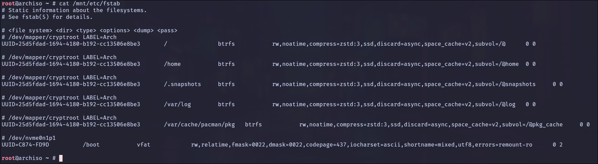

# Arch Linux Installation

## Phase 1: Preparation

### 1. Gathering the Ingredients

Navigate to the [Arch Linux Download page](https://archlinux.org/download/) and grab these three files. Place them in the same folder:

- **The ISO:** `archlinux-202X.XX.XX-x86_64.iso`
- **The Checksum:** `sha256sums.txt`
- **The Signature:** `archlinux-202X.XX.XX-x86_64.iso.sig`

---

### 2. Verification (The Security Check)

Before touching your USB drive, ensure the file is perfect.

1. Integrity Check
    
	Run this to ensure the file wasn't corrupted during the download:

	```bash
	sha256sum -c sha256sums.txt
	```

	**Note:** You may see errors for other files; as long as it says `archlinux-			202x...iso: OK`, you are safe.

2. Authenticity Check

	Run this to ensure the file is officially from the Arch team:

	```bash
	gpg --keyserver-options auto-key-retrieve --verify archlinux-202X.XX.XX-x86_64.iso.sig
	```

	**Success:** Look for `gpg: Good signature from "[Developer Name]"`. Ignore the warning 	about "not certified with a trusted signature"—that is standard behavior for GPG.

---

### 3. Creating the Bootable USB

Now we move the data from your computer to the USB drive.

1. Identify the Drive

	Plug in your USB and identify its path. **Be extremely careful here; choosing the wrong drive will erase it.**

	Run:
	
	```bash
	lsblk
	```
	***Note***: Your USB is usually /dev/sdb or /dev/sdc.

2. The "Imaging" Command

	We use the `dd` (Data Duplicator or Disk Destroyer) command. Replace `/dev/sdX` with your actual USB path (e.g., `/dev/sdb`).


	First, unmount the partition:

	```bash
	umount /dev/sdb
	```

	Now, we'll use `dd`. This command will take the input file (`if`)—your new Arch ISO—and write it to the output file (`of`)—your USB drive.
	
	**The command structure looks like this:**
	
	```bash
	sudo dd bs=4M if=/full/path/archlinux-202X.XX.XX-x86_64.iso of=/dev/sdX conv=fsync oflag=direct status=progress
	```
	
	- `bs=4M`: Sets the block size to 4 Megabytes for faster writing. ⚡
	- `conv=fsync`: Ensures all data is physically written to the drive before the command finishes. 💾
	- `status=progress`: Shows you a live update of the transfer speed and time. 📊
	
	**Note**: `of=/dev/sdX`: Ensure this is the **drive** (e.g. sdb), not a **partition** (e.g. sdb1).

---

### 4. Booting the ISO

1. Insert your prepared USB drive into the target machine.
2. Restart and enter your **BIOS/UEFI** (usually by tapping `F2`, `F12`, `Del`, or `Esc`).
3. **Disable Secure Boot** (Arch's official ISO doesn't support it out of the box).
4. Select your USB drive as the primary boot device.
5. Choose **"Arch Linux install medium (x86\_64, UEFI)"** from the menu.

---

### 5. Network &amp; Time

1. Connecting to Wi-Fi (if needed)

	Once you see the `root@archiso #` prompt, you need internet to download the system files.
	If you know your device name and network name run this command:

	```bash
	iwctl --passphrase "YOUR_PASSWORD" station wlan0 connect "YOUR_SSID"
	```

	If not do this steps:

	- **Enter the utility:** `iwctl`
	- **Identify your device:** `device list` (Usually `wlan0`)
	- **Scan for networks:** `station wlan0 scan`
	- **List networks:** `station wlan0 get-networks`
	- **Connect to your SSID:** `station wlan0 connect YOUR_SSID`
	- **Enter Password:** Type your Wi-Fi key when prompted.
	- **Exit:** Type `exit`.
	
	**Verification:** Run `ping -c 3 google.com`. If you get replies, you’re online!

3. Synchronize the System Clock

	*Update system clock:*

	```bash
	timedatectl set-ntp true
	```
	
	*Check status with:*
	
	```bash
	timedatectl status
	```


	*Explanation:* `timedatectl` synchronizes your clock. If your clock is wrong, SSL certificates (used by HTTPS websites/mirrors) will appear invalid, and package downloads will fail.

---

### 6. Setting up the SSH Bridge (Optional)

Installation is easier when you can copy-paste commands from your main computer.

1. **Set a temporary root password (t**his password is only for the **live session):**

	```bash
	 passwd
	```
    
    **Note:** This is only for the **live session**. It disappears when you reboot and won't affect your final system.
2. **Start the SSH service:**
	```bash
    systemctl start sshd
    ```
3. **Find your IP address:**
	```bash
    ip addr show wlan0
    ```
    
    *Look for the number after `inet` (e.g., `192.168.1.15`).*
4. **Connect from your OTHER computer:** Open your terminal on your daily-driver machine and type:
    
    ```bash
    ssh root@192.168.1.15
    ```

---

### 7. Verify UEFI Mode

We ensure the system is booted in UEFI mode, as `systemd-boot` requires it.

```bash
ls /sys/firmware/efi/efivars
```

*Explanation:* If this directory exists and is populated, you are in UEFI mode. If not, stop and check your BIOS settings.

---
---

## Phase 2: Partitioning &amp; Encryption

This is the most technical part of the build. We are creating a secure, high-performance foundation.

### 1. Wipe metadata

**Warning:** This will erase all data on `/dev/nvme0n1`(or your drive device).

```bash
sgdisk --zap-all /dev/nvme0n1
```

---

### 2. Partitioning

We will use `cfdisk` to create a simple, robust partition table.

Run `cfdisk /dev/nvme0n1`. Create the following:

1. **Label Type:** Select `gpt`.
2. Create a **New** partitions:

| Partition | Size | Type | Explanation |
| :--- | :--- | :--- | :--- |
| `/dev/nvme0n1p1` | **1 GiB** | EFI System | Large size to hold multiple Kernel images and rescue images. |
| `/dev/nvme0n1p2` | **Remainder** | Linux root (x86-64) | This will hold our Encrypted Container. |
 3. Select "**Write**" -&gt; "**yes**" -&gt; "**Quit**".

**Pro-Tip: Why "Linux root (x86-64)"?** We use this specific type instead of the generic "Linux filesystem" to follow modern standards. It allows the system to automatically identify your drive as the "root" partition, which adds a layer of redundancy if your configuration files ever have issues.

---

### 3. Format EFI Partition

```bash
mkfs.fat -F 32 /dev/nvme0n1p1
```

***Explanation**:* The UEFI motherboard firmware can only read FAT32 filesystems. This is where the bootloader lives.

---

### 4. Encrypt Root Partition (LUKS2)

We encrypt the raw partition before putting a filesystem on it.

```bash
cryptsetup luksFormat /dev/nvme0n1p2
```

 ***Explanation**:* Initializes the partition with LUKS2 encryption. You will set a passphrase here.
 
***Note**:* By default, this uses **Argon2id**, the modern memory-hard key derivation function (highly secure). You **must** type `YES` in all capital letters.

---

### 5. Unlock Partition

```bash
cryptsetup open /dev/nvme0n1p2 cryptroot
```

***Explanation:*** Decrypts the drive and maps it to `/dev/mapper/cryptroot`. The system treats `cryptroot` as a standard unencrypted drive from now on.

***Verification Step:*** Run `lsblk`. You should now see `cryptroot` nested under your second partition:


---

## Phase 3: Btrfs Subvolume Layout

This phase is where you define how your data is organized and how your system will handle "time travel" (backups/snapshots). Btrfs allows "Subvolumes"—dynamic partitions that share the same free space. We are going to use the **"Lean Snapshot"** strategy. This ensures that when you take a system backup, it stays tiny by excluding folders that don't need to be saved (like caches and logs).


### 1. Format the Unlocked Vault

Now that your LUKS container is open at `/dev/mapper/cryptroot`, we format it with Btrfs.

```bash
mkfs.btrfs -L Arch /dev/mapper/cryptroot
```

---

### 2. Create the Subvolume Layout

To create subvolumes, we must first mount the main partition temporarily.

```bash
mount /dev/mapper/cryptroot /mnt
```

Now, create the subvolumes. Notice we are separating the "heavy" folders like `@pkg_cache` and `@log`.

```bash
btrfs subvolume create /mnt/@
btrfs subvolume create /mnt/@home
btrfs subvolume create /mnt/@snapshots
btrfs subvolume create /mnt/@log
btrfs subvolume create /mnt/@pkg_cache
```

***Explanation***:

- **`@` (Root):** Contains the OS. We snapshot this to roll back the system.
- **`@home`:** Your personal data. Excluded from root snapshots so rolling back the OS doesn't delete your documents.
- **`@snapshots`:** Where Snapper saves the snapshots. Kept separate to prevent infinite recursion (snapshotting the snapshot folder).
- **`@log`:** System logs. Excluded so that if you roll back a broken system, you can still read the logs to see *why* it broke.
- **`@pkg_cache`:** Pacman cache. Excluded so you don't lose downloaded packages after a rollback (saves re-downloading).
- **Note on `@var`:** We do **NOT** separate `/var` entirely. The pacman database (`/var/lib/pacman`) MUST stay with the Root (`@`). If you separate it and roll back Root, your installed binaries won't match the database, breaking package management.

Unmount the temporary root:

```bash
umount /mnt
```

---

### 3. Mount Boot Partition and Subvolumes with Optimizations

We will now mount everything in its final location using performance flags.

1. **First, mount the Root (`@`):**

	```bash
	mount -o noatime,compress=zstd,ssd,discard=async,space_cache=v2,subvol=@ /dev/mapper/cryptroot /mnt
	```

2. Next, create the mount points (the "folders"):

	```bash
	mkdir -p /mnt/{home,.snapshots,var/log,var/cache/pacman/pkg,boot}
	```

3. Now, mount the rest of the subvolumes:

	```bash
	mount -o noatime,compress=zstd,ssd,discard=async,space_cache=v2,subvol=@home /dev/mapper/cryptroot /mnt/home
	mount -o noatime,compress=zstd,ssd,discard=async,space_cache=v2,subvol=@snapshots /dev/mapper/cryptroot /mnt/.snapshots
	mount -o noatime,compress=zstd,ssd,discard=async,space_cache=v2,subvol=@log /dev/mapper/cryptroot /mnt/var/log
	mount -o noatime,compress=zstd,ssd,discard=async,space_cache=v2,subvol=@pkg_cache /dev/mapper/cryptroot /mnt/var/cache/pacman/pkg
	```

	***Explanation:***
	
	| Flag | Why we use it |
	| :--- | :--- |
	| **`compress=zstd`** | **The Space Saver.** Compresses data on the fly. It makes the disk "faster" because the CPU compresses the data quicker than the disk can write the uncompressed version. |
	| **`noatime`** | **The Life Extender.** Normally, Linux writes to the disk every time you simply *read* a file (to record the "access time"). This turns that off, reducing unnecessary wear on your NVMe. |
	| **`ssd`** | **Layout Optimization.** Tells Btrfs to use allocation strategies specifically designed for solid-state storage rather than spinning platters. |
	| **`discard=async`** | **The Background Cleaner.** This is the modern way to handle "TRIM." It tells the SSD which blocks are no longer used in the background, keeping your write speeds high over time. |
	| **`space_cache=v2`** | **Fast Booting.** This flag helps the system track free space much faster. While it is technically the default in modern Linux kernels (5.15+), explicitly including it is a "safety first" practice. |

4. Finaly, mount the Boot Partition:

	```bash
	mount /dev/nvme0n1p1 /mnt/boot
	```

---

### 4. Verification Step

Before moving to the next phase, verify that your "plumbing" is correct. Run:

```bash
lsblk
```

***Success look like this*:** You should see your drive (`nvme0n1`) with two partitions. Under the second partition, you should see `cryptroot` with **all five** mount points listed:


If a mount point is missing, go back and re-run the `mount` command for that subvolume!

---

### 5. Why this layout is "Lean"

By mounting `@log` and `@pkg_cache` as separate subvolumes, they are technically **outside** your root (`@`) subvolume. When you use a tool like `Snapper` to snapshot `@`, it will "skip" these folders.

- **Space Saved:** Your system snapshots won't grow every time you download a large update or generate massive logs.
- **Safety:** If you roll back your system to "yesterday," you won't lose the logs from "today," which helps you figure out what went wrong.

---

## Phase 4: Base System Installation


Now that the foundation is ready, this is the part where we pull the official Arch Linux packages from the mirrors and install them into your `/mnt` directory. This phase is fast because we do the heavy lifting **once** we are inside the new system.

### 1. Update the Mirrors (Optional but Recommended)

To ensure fast download speeds, pick the best servers:

```bash
reflector --country Canada --age 12 --protocol https --sort rate --save /etc/pacman.d/mirrorlist
```

**Tip:** If you aren't in Canada, replace `Canada` with your own country (e.g., `United States`, `Germany`, `France`). You can also list multiple countries separated by commas, like `--country 'United States,Canada'`.

Here is the breakdown of the command:

- **`reflector`**: The base command that runs the mirror-sorting utility.
- **`--country Canada`**: Limits the search to servers physically located in Canada. This is crucial for speed because it reduces "latency" (the time it takes for a server to respond to a request).
- **`--age 12`**: Only includes mirrors that have successfully synchronized with the main Arch Linux server within the last 12 hours. This ensures you aren't using "stale" mirrors that are missing the latest software or security patches.
- **`--protocol https`**: Only includes mirrors that support encrypted HTTPS connections. This provides a layer of security by preventing "Man-in-the-Middle" attacks from tampering with your data during transit.
- **`--sort rate`**: Ranks the filtered list based on download speed (transfer rate). The fastest server will be placed at the top of the file.
- **`--save /etc/pacman.d/mirrorlist`**: Tells the program to take the resulting list and overwrite your existing mirrorlist file. This is the file `pacman` looks at whenever you install or update a package.

---

### 2. The `pacstrap` Command

We will now install the base system, the Linux kernel, and essential firmware. We are adding several critical tools here so you aren't left without internet or a text editor when you first reboot.

```bash
pacstrap -K /mnt base linux linux-firmware linux-firmware-marvell btrfs-progs neovim networkmanager sudo
```

- **`base`**: Minimal filesystem and core tools (ls, cp, bash).
- **`base-devel`**: GCC, Make, Sudo. Required for compiling AUR packages later. (optional)
- **`linux`** : Standard Linux Kernel.
- **`linux-firmware`**: Drivers for Wi-Fi, GPUs, etc.
- **`linux-firmware-marvell`**: **Critical:** Specific firmware required for Marvell wireless chips (common in Surface devices and certain laptops).
- **`btrfs-progs`**: Userspace tools to manage Btrfs.
- **`networkmanager`**: Easy network management tool.
- **`neovim`**: Text editor (use `nano` if you prefer).
- **`sudo`**: Allow a regular user to run commands with administrative (root) privileges. If you choose to install `base-devel`, you do **not** need to list `sudo` separately, as it is already included inside this package.

---

### 3. Generate the File System Table (`fstab`)

This tells the system where all those subvolumes are.

```bash
genfstab -U /mnt >> /mnt/etc/fstab
```

***Action**:* fstab Verification

Before moving forward, it is critical to verify that your filesystem table was generated correctly. Run:

```bash
cat /mnt/etc/fstab
```

**What to look for:** On a Btrfs system like this one, your `fstab` will look a bit different than a traditional setup.

- **The UUID:** You should see the same long **UUID** string repeated for almost every entry. This is because all your subvolumes (`@`, `@home`, `@log`, etc.) live on the same physical partition.
- **Subvolume Flags:** Look at the options column (usually the 4th column). Each line must have a unique `subvol=@...` entry matching the subvolumes you created in Phase 3.
- **Mount Points:** Ensure the paths match your intended layout (e.g., the line with `subvol=@log` should point to `/var/log`).



**Note :** Your UUID (the long string of letters and numbers) will be different from the one in the image. Don't copy it! Just verify that your UUID is consistent across all your Btrfs entries.

---

### 4. Enter the System (Chroot)

Now that the "plumbing" is verified, we are going to "step inside" your new installation. From this point on, any command you run happens on your NVMe drive, not the USB stick.

```bash
arch-chroot /mnt
```

***Success*:** Your terminal prompt will change to `[root@archiso /]#`. You are now officially configuring your new OS!

---

## Phase 5: System Configuration

Now we install the core drivers and utilities while configuring the time, language, and performance settings that make the system truly yours."

### 1. The Essentials (The Bulk Command)

This command installs the "foundation" of your system, including the bootloader, hardware drivers, and core utilities required for a modern, functional desktop.

**Note:** Use `intel-ucode` for Intel CPUs or `amd-ucode` for AMD.

```bash
pacman -S grub efibootmgr zram-generator intel-ucode reflector linux-headers bluez bluez-utils xdg-utils xdg-user-dirs network-manager-applet pipewire pipewire-pulse pipewire-alsa pipewire-jack wireplumber
```

***Package Breakdown***:

- **`grub` &amp; `efibootmgr`**: The core tools required to create and manage your boot menu so the motherboard can find Arch.
- **`zram-generator`**: The modern way to handle swap, compressing data in your RAM to keep the system fast under heavy load.
- **`intel-ucode`**: Critical stability and security patches for your CPU (essential for modern hardware).
- **`reflector`**: A script that fetches and sorts the fastest Arch mirrors to keep your future updates speedy.
- **`linux-headers`**: Required if you ever plan to install "out-of-tree" drivers like VirtualBox or certain Wi-Fi/NVIDIA drivers.
- **`bluez` &amp; `bluez-utils`**: The "brain" and tools for Bluetooth. You'll need these to connect your headphones or mouse.
- **`xdg-user-dirs`**: Automatically creates the standard folders in your home directory (Documents, Downloads, Music, etc.) once you log in.
- **`xdg-utils`**: A set of command-line tools that help different apps talk to each other (e.g., "open this link in the browser").
- **`network-manager-applet`**: Provides the Wi-Fi icon in your future desktop environment so you don't have to use the terminal for Wi-Fi anymore. (requires a GUI to actually show up)
- **`pipewire`**: The main "engine" that handles audio and video streams.
- **`pipewire-pulse`**: A "translator" that lets apps designed for PulseAudio (like Spotify or Discord) work with PipeWire.
- **`pipewire-alsa` &amp; `pipewire-jack`**: Ensures that even the oldest and the most professional audio apps can output sound.
- **`wireplumber`**: The "brain" that manages the logic—it decides which speakers to use when you plug in headphones.

1. Useful packages you can add

- Power Management (For Laptops)

	If this is a laptop, your battery will drain much faster than it should without a power daemon.
	
	- **Package:** `power-profiles-daemon`
	- **Why:** This is the modern standard used by GNOME and KDE. It lets you switch between "Power Saver," "Balanced," and "Performance" modes easily.
	- **Enable:** `systemctl enable power-profiles-daemon`
	
- Printer Support (The "Just in Case")

	Even if you don't own a printer, you'll eventually need to "Print to PDF" or connect to a wireless printer at a library or office.
	
	- **Packages:** `cups` and `avahi`
	- **Why:** `cups` is the printing engine; `avahi` is what allows your computer to "see" printers (and other devices) on your Wi-Fi network without typing in IP addresses.
	- **Enable:** `systemctl enable cups` and `systemctl enable avahi-daemon`
	
- Basic Graphics Drivers (The "Visual Brain")

	We have the CPU patches, but your screen needs to know how to talk to your GPU (Intel, AMD, or NVIDIA) for smooth animations.

	- **Packages:**
	    
	    
	    - **Intel:** `vulkan-intel` and `intel-media-driver`
	        
	        
	        - *Note: `vulkan-intel` handles the graphics, while `intel-media-driver` allows your hardware to decode video (like YouTube/Netflix) so your CPU doesn't have to work as hard.*
	    - **AMD:** `vulkan-radeon`
	    - **NVIDIA:** `nvidia` (or `nvidia-open` for newer cards)
	- **Why:** This ensures your future Desktop Environment (like GNOME or KDE) uses hardware acceleration. Without this, your CPU has to do all the visual work, making the system feel "laggy."

---

### 2. Localization, Time and Keyboard

This section tells Arch your timezone, your language, and how your keyboard is laid out. You must adjust these commands to match your specific location.

1. Set Your Timezone:
	Replace America/Edmonton with your actual Region and City. You can find your options by looking in /usr/share/zoneinfo/.

	```bash
	ln -sf /usr/share/zoneinfo/America/Edmonton /etc/localtime
	```

3. Update the hardware clock to stay in sync:

	```bash
	hwclock --systohc
	```

4. Set Language (Locale):
   If you do not want US English, replace en_US.UTF-8 with your preferred language from the list in /etc/locale.gen.

	```bash
	echo "en_US.UTF-8 UTF-8" >> /etc/locale.gen
	```

	***Note***: This adds the US English locale to the generation list without opening an editor.

6. Generate the language files:

	```bash
	locale-gen
	```

7. Create Locale Config:
   This sets the system language.

	```bash
	echo "LANG=en_US.UTF-8" > /etc/locale.conf
	```

9. Set Console Keyboard Layout:
   The default is us. If you use a different layout (like uk or br-abnt2), replace it here so your keys work correctly in the terminal.

	```bash
	echo "KEYMAP=us" > /etc/vconsole.conf
	```

---

### 3. Network Identity

1. Give your computer a name:

	```bash
	echo "arch-linux" > /etc/hostname
	```
	
2. Edit your hosts file:
	
	```bash
	nvim /etc/hosts
	```
	
3. Add this text to the file:
	
	```
	127.0.0.1   localhost
	::1         localhost
	127.0.1.1   arch-linux.localdomain   arch-linux
	```

	**Note:** Ensure "arch-linux" matches the name you chose in the `/etc/hostname` file above.

---

### 4. High-Performance zRAM

Instead of a slow swap file on your disk, we use zRAM. This creates a compressed "virtual drive" inside your RAM that acts as an ultra-fast swap area. Since we just installed the generator, let's configure it.

1. Open the file:

	```bash
	nvim /etc/systemd/zram-generator.conf
	```

2. Paste this in:

	```ini
	[zram0]
	zram-size = min(ram / 2, 4096)
	compression-algorithm = zstd
	swap-priority = 100
	fs-type = swap
	```
 	
	Configuration Breakdown:
	
	`[zram0]`: Defines the name of the virtual device created in your memory.
	
	`zram-size = min(ram / 2, 4096)`: Sets the swap size to half of your physical RAM, but caps it at 4GB to prevent exhausting your memory.
	
	`compression-algorithm = zstd`: Uses the zstd algorithm, which offers the best balance between high compression ratios and low CPU overhead.
	
	`swap-priority = 100`: Tells Linux to use this compressed RAM space first before attempting to use any slower swap files on the physical disk.
	
	`fs-type = swap`: Formats the virtual device as a swap area so the Linux kernel knows it can store "overflow" memory pages there.

---

## Phase 6: Mkinitcpio &amp; Bootloader

This is the critical step for booting an encrypted drive.

### 1. Configure Mkinitcpio

We need to tell Arch to include the tools for encryption and the Btrfs filesystem in the initial boot process.

1. **Open the configuration:**

	```
	nvim /etc/mkinitcpio.conf
	```

2. **Edit the MODULES line:** Find the `MODULES=()` line. and add btrfs to it:

	```
	MODULES=(btrfs)
	```

3. ****Edit the HOOKS line:** Find the `HOOKS=(...)` line. It must look exactly like this:**

	```
	HOOKS=(base systemd autodetect microcode modconf kms keyboard keymap sd-vconsole sd-encrypt block filesystems fsck)
	```

	**Note:** We use `sd-encrypt` because it integrates perfectly with the modern `systemd` boot process we are building.

4. **Generate the images:**

	```bash
	mkinitcpio -P
	```

---

### 2. The "Gatekeeper" (GRUB)

Now we configure the bootloader to find your specific encrypted partition.

1. **Find your Partition UUID:** Run this command to get the unique ID of your LUKS partition (`/dev/nvme0n1p2`):

	```bash
	blkid -s UUID -o value /dev/nvme0n1p2
	```

	**Tip:** Copy this long string carefully.

2. **Edit GRUB's configuration:**

	```bash
	nvim /etc/default/grub
	```

3. **Set the Boot Parameters:** 
	Find the line `GRUB_CMDLINE_LINUX_DEFAULT` and change it to (paste your UUID where indicated):

	```
	GRUB_CMDLINE_LINUX_DEFAULT="loglevel=3 quiet rd.luks.name=YOUR_UUID_HERE=cryptroot root=/dev/mapper/cryptroot rootflags=subvol=@"
	```

4. **Install GRUB to the motherboard:**

	```bash
	grub-install --target=x86_64-efi --efi-directory=/boot --bootloader-id=GRUB
	```

5. **Generate the final config file:**

	```bash
	grub-mkconfig -o /boot/grub/grub.cfg
	```

---

### 3. User Setup

Before we leave, we need to create the people who will live in this system.

1. **Set the Root Password**:

	This is the "Master" password for the entire system.

	```bash
	passwd
	```

2. **Create Your User**:

	Replace `paulo` with your preferred username.

	```bash
	useradd -m -G wheel paulo
	```

3. **Set the User Password:**

	```bash
	passwd paulo
	```

4. **Grant Administrative Privileges (Sudo)**:
 
	Since you installed `sudo` in Phase 4, you need to tell it that your user is allowed to use it.
	
	```bash
	EDITOR=nvim visudo
	```

	**Action:** Find the line `%wheel ALL=(ALL:ALL) ALL` and remove the `#` from the front. Save and exit (`:wq`).

---

### 4. Enable Services

Ensure your system is ready to connect to the world on the first boot.

```bash
systemctl enable NetworkManager
systemctl enable bluetooth
systemctl enable fstrim.timer
```

**The "Enable" Breakdown:**

| Command | Simple Explanation | Why it’s Essential |
| :--- | :--- | :--- |
| **`systemctl enable NetworkManager`** | Starts the internet manager automatically at boot. | Prevents being stuck in a terminal with no Wi-Fi or Ethernet to download updates. |
| **`systemctl enable bluetooth`** | Activates the Bluetooth stack in the background. | Without this, wireless mice, keyboards, or headphones will not connect. |
| **`systemctl enable fstrim.timer`** | Schedules a weekly "cleanup" (Trim) of your drive. | Provides automatic maintenance to keep your NVMe/SSD fast and healthy. |

---

### 5. The Escape Sequence

Run these commands in order. This ensures all your data is physically written to the NVMe and the "vault" is locked safely before the restart.

1. Step out of the new system

	This takes you out of the `arch-chroot` and back to the USB environment.
	
	```bash
	exit
	```

2. Unmount everything

	This "unplugs" all your Btrfs subvolumes and your boot partition safely.
	
	```bash
	umount -R /mnt
	```

3. Close the Encrypted Vault

	This locks your LUKS partition so it can be re-opened by your bootloader.
	
	```bash
	cryptsetup close cryptroot
	```

4. The Final Reboot

	Pull out your USB drive once the screen goes dark!
	
	```bash
	reboot
	```

---

## Phase 7: Post-Install (The First Boot)

Welcome to your new Arch Linux system. Now that you’ve rebooted and logged in, let’s get the system connected and optimized.

### 1. Connect to Wi-Fi

Since we are now in the installed system, we use `nmcli` (Network Manager) to handle our connections permanently.

1. **Turn on the Wi-Fi radio:**

	```bash
	nmcli radio wifi on
	```

2. **List available networks:**

	```bash
	nmcli device wifi list
	```

3. **Connect to your network:**

	```bash
	nmcli device wifi connect "YOUR_SSID" password "YOUR_PASSWORD"
	```

---

### 2. Enable Remote Management SSH (Optional) 

If you prefer to finish the setup from another computer (for easier copy-pasting), install and enable the SSH daemon:

1. Install the Server:

	You installed `base`, but you might not have the SSH daemon yet. Run this on your Arch machine.

	```
	sudo pacman -S openssh
	```

2. Start and Enable the Service:

	This makes the “door” available now and every time you reboot.

	```
	sudo systemctl enable --now sshd
	```

3. Find Your IP Address:

	You need to know where to point your other computer.

	```
	ip addr show
	```

	***Note***: Look for the number next to inet under your Wi-Fi or Ethernet (usually looks like 192.168.1.X).
	
---

### 3. Optimize Your Mirrors (Reflector)
The mirrors used during installation might not be the fastest for your specific location. We’ll use reflector to find the best servers near you.

```
sudo reflector --country 'Canada,United States' --latest 10 --protocol https --sort rate --save /etc/pacman.d/mirrorlist
```

***What this does***: It finds the 10 most recently synchronized HTTPS mirrors in your region, tests their actual download speed, and saves the winners to your system.

#### Automate Your Mirror Updates

Reflector comes with a built-in service that can update your mirrors automatically. Let’s configure it to run once a week so your system always stays fast.

1. Edit the Reflector configuration:
	
	```
	sudo nvim /etc/xdg/reflector/reflector.conf
	```

2. Paste this “High-Speed” config Replace everything in that file with this. This tells Reflector to find the 10 fastest HTTPS mirrors in Canada or the US updated in the last 12 hours:

	```
	--save /etc/pacman.d/mirrorlist
	--protocol https
	--country Canada,United States
	--latest 10
	--sort rate
	--age 12
	```

3. Enable the Timer Now, "flip the switch" to make it run automatically every week:

	```bash
	sudo systemctl enable --now reflector.timer
	```

---

### 4. Synchronize and Update

Now that you have fast mirrors, let’s do a final sync to make sure everything is perfectly up to date.

```bash
sudo pacman -Syu
```

---

### 5. Verify Your Services

Before you move on run these commands to ensure your essential performance and maintenance services are running correctly:

1. **The "Master Schedule" Check:** 

	Run this to see all your automated tasks (Reflector, Trim, etc.) in one list.
	
	```bash
	systemctl list-timers --all
	```
	
	****What to look for:** Ensure `fstrim.timer` and `reflector.timer` are listed in the `ACTIVATES` column.**

2. **The Hardware & Performance Check:** 

	Since these aren't "timers," we check them individually.
	
	- **zRAM:** `zramctl` (Confirms your RAM-based swap is active).
	- **Audio:** `wpctl status` (Confirms PipeWire has "claimed" your speakers).
	- **Network:** `nmcli device` (Confirms you are online and managed).

---

## Phase 8: System Hardening (Security)

Encryption (LUKS) protects your data when your computer is stolen or powered off. **System Hardening** protects you while you are actually using the computer and connected to the internet.

### 1. The Firewall (UFW)

We will use **UFW** (Uncomplicated Firewall). It is the standard for "set and forget" security. It blocks all unauthorized "knocks" on your system's digital doors.

1. Instal the UFW Firewall:

	```bash
	sudo pacman -S ufw
	```

2. Enable ans start (`--now`) the firewall:

	```bash
	sudo systemctl enable --now ufw
	```


****CRITICAL:** If you are currently connected via SSH, you must allow the SSH port before enabling the firewall, or you will be locked out!

3. **First explicitly allow SSH:**

	```bash
	sudo ufw allow ssh
	```

4. **Eet the default "Stealth" rules:**

	```bash
	sudo ufw default deny incoming
	sudo ufw default allow outgoing
	```

5. Turn it on
	```
	sudo ufw enable
	```
	
**What this does:** By setting a Default Deny policy for incoming traffic, you are creating a "one-way" security gate. Your system will track every request you send out (like opening a website) and allow the response back in, but it will silently drop any connection attempt initiated by an outside device. This effectively shields your open ports from scanners and unauthorized access while you are on untrusted networks.

---
