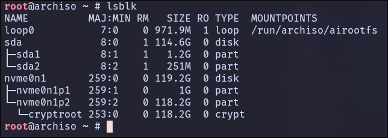
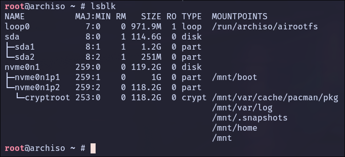

# Arch Linux Installation

## Phase 1: Preparation

### 1. Gathering the Ingredients

Navigate to the [Arch Linux Download page](https://archlinux.org/download/) and grab these three files. Place them in the same folder:

- **The ISO:** `archlinux-202X.XX.XX-x86_64.iso`
- **The Checksum:** `sha256sums.txt`
- **The Signature:** `archlinux-202X.XX.XX-x86_64.iso.sig`

---

### 2. Verification (The Security Check)

Before touching your USB drive, ensure the file is perfect.

1. Integrity Check
    
	Run this to ensure the file wasn't corrupted during the download:

	```bash
	sha256sum -c sha256sums.txt
	```

	**Note:** You may see errors for other files; as long as it says `archlinux-			202x...iso: OK`, you are safe.

2. Authenticity Check

	Run this to ensure the file is officially from the Arch team:

	```bash
	gpg --keyserver-options auto-key-retrieve --verify archlinux-202X.XX.XX-x86_64.iso.sig
	```

	**Success:** Look for `gpg: Good signature from "[Developer Name]"`. Ignore the warning 	about "not certified with a trusted signature"—that is standard behavior for GPG.

---

### 3. Creating the Bootable USB

Now we move the data from your computer to the USB drive.

1. Identify the Drive

	Plug in your USB and identify its path. **Be extremely careful here; choosing the wrong drive will erase it.**

	Run:
	
	```bash
	lsblk
	```
	***Note***: Your USB is usually /dev/sdb or /dev/sdc.

2. The "Imaging" Command

	We use the `dd` (Data Duplicator or Disk Destroyer) command. Replace `/dev/sdX` with your actual USB path (e.g., `/dev/sdb`).


	First, unmount the partition:

	```bash
	umount /dev/sdb
	```

	Now, we'll use `dd`. This command will take the input file (`if`)—your new Arch ISO—and write it to the output file (`of`)—your USB drive.
	
	**The command structure looks like this:**
	
	```bash
	sudo dd bs=4M if=/full/path/archlinux-202X.XX.XX-x86_64.iso of=/dev/sdX conv=fsync oflag=direct status=progress
	```
	
	- `bs=4M`: Sets the block size to 4 Megabytes for faster writing. ⚡
	- `conv=fsync`: Ensures all data is physically written to the drive before the command finishes. 💾
	- `status=progress`: Shows you a live update of the transfer speed and time. 📊
	
	**Note**: `of=/dev/sdX`: Ensure this is the **drive** (e.g. sdb), not a **partition** (e.g. sdb1).

---

### 4. Booting the ISO

1. Insert your prepared USB drive into the target machine.
2. Restart and enter your **BIOS/UEFI** (usually by tapping `F2`, `F12`, `Del`, or `Esc`).
3. **Disable Secure Boot** (Arch's official ISO doesn't support it out of the box).
4. Select your USB drive as the primary boot device.
5. Choose **"Arch Linux install medium (x86\_64, UEFI)"** from the menu.

---

### 5. Network &amp; Time

1. Connecting to Wi-Fi (if needed)

	Once you see the `root@archiso #` prompt, you need internet to download the system files.
	If you know your device name and network name run this command:

	```bash
	iwctl --passphrase "YOUR_PASSWORD" station wlan0 connect "YOUR_SSID"
	```

	If not do this steps:

	- **Enter the utility:** `iwctl`
	- **Identify your device:** `device list` (Usually `wlan0`)
	- **Scan for networks:** `station wlan0 scan`
	- **List networks:** `station wlan0 get-networks`
	- **Connect to your SSID:** `station wlan0 connect YOUR_SSID`
	- **Enter Password:** Type your Wi-Fi key when prompted.
	- **Exit:** Type `exit`.
	
	**Verification:** Run `ping -c 3 google.com`. If you get replies, you’re online!

3. Synchronize the System Clock

	*Update system clock:*

	```bash
	timedatectl set-ntp true
	```
	
	*Check status with:*
	
	```bash
	timedatectl status
	```


	*Explanation:* `timedatectl` synchronizes your clock. If your clock is wrong, SSL certificates (used by HTTPS websites/mirrors) will appear invalid, and package downloads will fail.

---

### 6. Setting up the SSH Bridge (Optional)

Installation is easier when you can copy-paste commands from your main computer.

1. **Set a temporary root password (t**his password is only for the **live session):**

	```bash
	 passwd
	```
    
    **Note:** This is only for the **live session**. It disappears when you reboot and won't affect your final system.
2. **Start the SSH service:**
	```bash
    systemctl start sshd
    ```
3. **Find your IP address:**
	```bash
    ip addr show wlan0
    ```
    
    *Look for the number after `inet` (e.g., `192.168.1.15`).*
4. **Connect from your OTHER computer:** Open your terminal on your daily-driver machine and type:
    
    ```bash
    ssh root@192.168.1.15
    ```

---

### 7. Verify UEFI Mode

We ensure the system is booted in UEFI mode, as `systemd-boot` requires it.

```bash
ls /sys/firmware/efi/efivars
```

*Explanation:* If this directory exists and is populated, you are in UEFI mode. If not, stop and check your BIOS settings.

---
---

## Phase 2: Partitioning &amp; Encryption

This is the most technical part of the build. We are creating a secure, high-performance foundation.

### 1. Wipe metadata

**Warning:** This will erase all data on `/dev/nvme0n1`(or your drive device).

```bash
sgdisk --zap-all /dev/nvme0n1
```

---

### 2. Partitioning

We will use `cfdisk` to create a simple, robust partition table.

Run `cfdisk /dev/nvme0n1`. Create the following:

1. **Label Type:** Select `gpt`.
2. Create a **New** partitions:

| Partition | Size | Type | Explanation |
| :--- | :--- | :--- | :--- |
| `/dev/nvme0n1p1` | **1 GiB** | EFI System | Large size to hold multiple Kernel images and rescue images. |
| `/dev/nvme0n1p2` | **Remainder** | Linux root (x86-64) | This will hold our Encrypted Container. |
 3. Select "**Write**" -&gt; "**yes**" -&gt; "**Quit**".

**Pro-Tip: Why "Linux root (x86-64)"?** We use this specific type instead of the generic "Linux filesystem" to follow modern standards. It allows the system to automatically identify your drive as the "root" partition, which adds a layer of redundancy if your configuration files ever have issues.

---

### 3. Format EFI Partition

```bash
mkfs.fat -F 32 /dev/nvme0n1p1
```

***Explanation**:* The UEFI motherboard firmware can only read FAT32 filesystems. This is where the bootloader lives.

---

### 4. Encrypt Root Partition (LUKS2)

We encrypt the raw partition before putting a filesystem on it.

```bash
cryptsetup luksFormat /dev/nvme0n1p2
```

 ***Explanation**:* Initializes the partition with LUKS2 encryption. You will set a passphrase here.
 
***Note**:* By default, this uses **Argon2id**, the modern memory-hard key derivation function (highly secure). You **must** type `YES` in all capital letters.

---

### 5. Unlock Partition

```bash
cryptsetup open /dev/nvme0n1p2 cryptroot
```

***Explanation:*** Decrypts the drive and maps it to `/dev/mapper/cryptroot`. The system treats `cryptroot` as a standard unencrypted drive from now on.

***Verification Step:*** Run `lsblk`. You should now see `cryptroot` nested under your second partition:



---

## Phase 3: Btrfs Subvolume Layout

This phase is where you define how your data is organized and how your system will handle "time travel" (backups/snapshots). Btrfs allows "Subvolumes"—dynamic partitions that share the same free space. We are going to use the **"Lean Snapshot"** strategy. This ensures that when you take a system backup, it stays tiny by excluding folders that don't need to be saved (like caches and logs).


### 1. Format the Unlocked Vault

Now that your LUKS container is open at `/dev/mapper/cryptroot`, we format it with Btrfs.

```bash
mkfs.btrfs -L Arch /dev/mapper/cryptroot
```

---

### 2. Create the Subvolume Layout

To create subvolumes, we must first mount the main partition temporarily.

```bash
mount /dev/mapper/cryptroot /mnt
```

Now, create the subvolumes. Notice we are separating the "heavy" folders like `@pkg_cache` and `@log`.

```bash
btrfs subvolume create /mnt/@
btrfs subvolume create /mnt/@home
btrfs subvolume create /mnt/@snapshots
btrfs subvolume create /mnt/@log
btrfs subvolume create /mnt/@pkg_cache
```

***Explanation***:

- **`@` (Root):** Contains the OS. We snapshot this to roll back the system.
- **`@home`:** Your personal data. Excluded from root snapshots so rolling back the OS doesn't delete your documents.
- **`@snapshots`:** Where Snapper saves the snapshots. Kept separate to prevent infinite recursion (snapshotting the snapshot folder).
- **`@log`:** System logs. Excluded so that if you roll back a broken system, you can still read the logs to see *why* it broke.
- **`@pkg_cache`:** Pacman cache. Excluded so you don't lose downloaded packages after a rollback (saves re-downloading).
- **Note on `@var`:** We do **NOT** separate `/var` entirely. The pacman database (`/var/lib/pacman`) MUST stay with the Root (`@`). If you separate it and roll back Root, your installed binaries won't match the database, breaking package management.

Unmount the temporary root:

```bash
umount /mnt
```

---

### 3. Mount Boot Partition and Subvolumes with Optimizations

We will now mount everything in its final location using performance flags.

1. **First, mount the Root (`@`):**

	```bash
	mount -o noatime,compress=zstd,ssd,discard=async,space_cache=v2,subvol=@ /dev/mapper/cryptroot /mnt
	```

2. Next, create the mount points (the "folders"):

	```bash
	mkdir -p /mnt/{home,.snapshots,var/log,var/cache/pacman/pkg,boot}
	```

3. Now, mount the rest of the subvolumes:

	```bash
	mount -o noatime,compress=zstd,ssd,discard=async,space_cache=v2,subvol=@home /dev/mapper/cryptroot /mnt/home
	mount -o noatime,compress=zstd,ssd,discard=async,space_cache=v2,subvol=@snapshots /dev/mapper/cryptroot /mnt/.snapshots
	mount -o noatime,compress=zstd,ssd,discard=async,space_cache=v2,subvol=@log /dev/mapper/cryptroot /mnt/var/log
	mount -o noatime,compress=zstd,ssd,discard=async,space_cache=v2,subvol=@pkg_cache /dev/mapper/cryptroot /mnt/var/cache/pacman/pkg
	```

	***Explanation:***
	
	| Flag | Why we use it |
	| :--- | :--- |
	| **`compress=zstd`** | **The Space Saver.** Compresses data on the fly. It makes the disk "faster" because the CPU compresses the data quicker than the disk can write the uncompressed version. |
	| **`noatime`** | **The Life Extender.** Normally, Linux writes to the disk every time you simply *read* a file (to record the "access time"). This turns that off, reducing unnecessary wear on your NVMe. |
	| **`ssd`** | **Layout Optimization.** Tells Btrfs to use allocation strategies specifically designed for solid-state storage rather than spinning platters. |
	| **`discard=async`** | **The Background Cleaner.** This is the modern way to handle "TRIM." It tells the SSD which blocks are no longer used in the background, keeping your write speeds high over time. |
	| **`space_cache=v2`** | **Fast Booting.** This flag helps the system track free space much faster. While it is technically the default in modern Linux kernels (5.15+), explicitly including it is a "safety first" practice. |

4. Finaly, mount the Boot Partition:

	```bash
	mount /dev/nvme0n1p1 /mnt/boot
	```

---

### 4. Verification Step

Before moving to the next phase, verify that your "plumbing" is correct. Run:

```bash
lsblk
```

***Success look like this*:** You should see your drive (`nvme0n1`) with two partitions. Under the second partition, you should see `cryptroot` with **all five** mount points listed:



If a mount point is missing, go back and re-run the `mount` command for that subvolume!

---

### 5. Why this layout is "Lean"

By mounting `@log` and `@pkg_cache` as separate subvolumes, they are technically **outside** your root (`@`) subvolume. When you use a tool like `Snapper` to snapshot `@`, it will "skip" these folders.

- **Space Saved:** Your system snapshots won't grow every time you download a large update or generate massive logs.
- **Safety:** If you roll back your system to "yesterday," you won't lose the logs from "today," which helps you figure out what went wrong.

---
